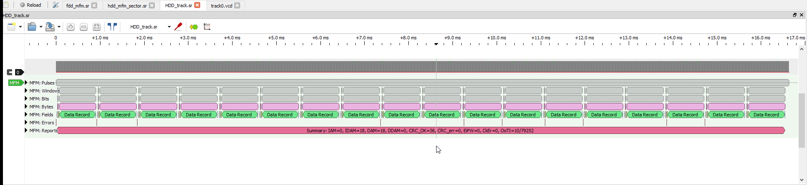
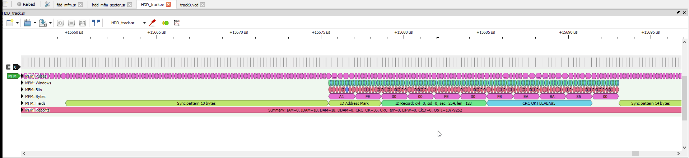

# FM/MFM/RLL decoder for Sigrok/PulseView/DSView
This [plugin](https://github.com/sigrokproject/libsigrokdecode) lets you explore and analyze data stored on floppy disks and MFM/RLL hard drives at the very low level using [Sigrok](https://sigrok.org)/[Sigrok-cli](https://sigrok.org/wiki/Sigrok-cli)([github](https://github.com/sigrokproject/sigrok-cli))/[PulseView](https://sigrok.org/wiki/PulseView)([github](https://github.com/sigrokproject/pulseview))/[DSView](https://github.com/DreamSourceLab/DSView) Logic Analyzer software.  

Start by loading one of available [test sample files](#available-test-sample-files) or capture you own data using Logic Analyzer hardware. Aim for 20x oversampling for best results.

- Floppies require at least ~12MHz sampling rate within reach of ~$60 Hantek 6022 or $5 CY7C68013A https://sigrok.org/wiki/Lcsoft_Mini_Board dev board (aliexpress/ebay/amazon) as thats pretty much whats inside the Hantek/original Saleae.  
- Hard drives operate at 5-15Mbit flux rate and demand at least 100MHz sampling clock for the 5Mbit MFM models. Commercial LAs start around $200, saner options are 200Ms/s Pico based [MFM-Hard-Disk-Dumper](https://github.com/Tronix286/MFM-Hard-Disk-Dumper) by Tronix286 or not so greatly named but outstandingly capable Pico/Pico2 based 400Ms/s [LogicAnalyzer](https://github.com/gusmanb/logicanalyzer). Both of those Open Source hardware solutions are vastly cheaper while delivering great results.

<h2>Table of Contents</h2>

- [Screenshots](#screenshots)
- [Samples](#available-test-sample-files)
- [Command line usage](#sigrok-cli-command-line-usage)
  - [Options](#options)
  - [Annotations](#annotations)
  - [Binary Output](#binary-output)
  - [Example invocation](#example-invocation)
- [Installation](#installation)
- [Resources](#resources)
  - [Polynomials](#polynomials)
  - [Converting polynomial notations](#converting-polynomial-notations)
  - [CRC](#crc)
  - [Tutorials](#tutorials)
  - [Patents](#patents)
  - [Datasheets](#datasheets)
  - [Miscellaneous](#miscellaneous)
  - [Emulation](#emulation)
- [Authors](#authors)
- [Changelog](#changelog)
- [Todo](#todo)

## Screenshots
#### Full Track view
  
Typical track on MFM encoded hard drive.

#### Sector Header close-up
  
This is a spare/unused sector created at the end of every track on MFM drive by Seagate ST21 controller. Notice the weird Sector number 254 and absence of GAP3 between end of Header and start of Sync pattern. Without GAP3 writing to this sector would causes corruption giving us a hint that this special Sector is not meant to ever be used. Every MFM/RLL drive I looked at so far wasted precious space either leaving enought unused disk surface for one more sector per track of having one dummy sector at the end like above. I know of only DEC RQDX1/2 using all 18 sectors, but DECs next [RQDX3](https://gunkies.org/wiki/RQDX3_MFM_Disk_%26_Floppy_QBUS_Controller#Version_details) controller went back to 17. This translates to never using 6% of MFM and 4% of RLL disk surface you paid for, about 2.5MB on typical 40MB MFM drive. For comparison 15 years later transition to 4K Sectors (88->97% efficiency gain) was the result of HDD manufacturers fighting for every scrap of capacity.

## Available test sample files
 - [fdd_fm.sr](https://github.com/raszpl/sigrok-mfm/raw/refs/heads/main/samples/fdd_fm.sr) 15MHz sample rate. FDD, 5:1 interleave. 125000 bps, FM format, 256 Byte Sectors, Data CRC 16bit, Data poly 0x1021

 - [fdd_mfm.sr](https://github.com/raszpl/sigrok-mfm/raw/refs/heads/main/samples/fdd_mfm.sr) 15MHz sample rate. FDD, 5:1 interleave. Cylinder 1, Head 0. 250000 bps, MFM format, 256 Byte Sectors, Data CRC 16bit, Data poly 0x1021

 - [hdd_mfm_RQDX3.sr](https://github.com/raszpl/sigrok-mfm/raw/refs/heads/main/samples/hdd_mfm_RQDX3.sr) 100MHz sample rate. 5000000 bps, MFM format, 512 Byte Sectors, Data CRC 32bit, Data poly 0xA00805. DEC RD54 (re-branded Maxtor XT-2190) containing VMS. Paired to build-in SMC HDC9224 (RQDX3 compatible?) disk controller in [VAXstation2000](https://gunkies.org/wiki/KA410_MicroVAX_2000/VAXstation_2000_System_Module). Note: Drive had rather [spectacularly blown Index pulse generator captured on video.](https://www.youtube.com/watch?v=rvOJJcxFEO4&t=2699)
 - [hdd_mfm_RQDX3.dsl](https://github.com/raszpl/sigrok-mfm/raw/refs/heads/main/samples/hdd_mfm_RQDX3.dsl) as above but in DSView format
 - [hdd_mfm_RQDX3_sector.sr](https://github.com/raszpl/sigrok-mfm/raw/refs/heads/main/samples/hdd_mfm_RQDX3_sector.sr) one sector (sec=8) from above capture. ID CRC F38D, Data CRC C1847279
 - [hdd_mfm_AMS1100M4.sr](https://github.com/raszpl/sigrok-mfm/raw/refs/heads/main/samples/hdd_mfm_AMS1100M4.sr) 200MHz sample rate. Cylinder 622, Head 1. Bad Sector 9. 5000000 bps, MFM format, Header size 3, data poly 0x140a0445. Seagate ST-251 formatted using American Multisource (AMS) 1100M4 (AIC-6060/CL-SH260, SSI 32D534)
 - [hdd_mfm_EV346.sr](https://github.com/raszpl/sigrok-mfm/raw/refs/heads/main/samples/hdd_mfm_EV346.sr) 200MHz sample rate. Cylinder 819, Head 2. 5000000 bps, MFM format, Header size 3, Data poly 0x140a0445. Seagate ST-251 formatted using Everex EV-346 (CL-SH260, SSI 32D534)
 - [hdd_mfm_WD1003V-MM2.sr](https://github.com/raszpl/sigrok-mfm/raw/refs/heads/main/samples/hdd_mfm_WD1003V-MM2.sr) 200MHz sample rate. 5000000 bps, MFM format,  Header size 3, data poly 0x140a0445. Seagate ST-278R formatted using WD1003V-MM2 (WD42C22A, WD10C22B)
 - [hdd_mfm_WD1003V-MM2_int.sr](https://github.com/raszpl/sigrok-mfm/raw/refs/heads/main/samples/hdd_mfm_WD1003V-MM2_int.sr) 200MHz sample rate. 2:1 interleave. 5000000 bps, MFM format, Header size 3, data poly 0x140a0445. Seagate ST-251 formatted using WD1003V-MM2 (WD42C22A, WD10C22B)
 - [hdd_mfm_NDC5525.sr](https://github.com/raszpl/sigrok-mfm/raw/refs/heads/main/samples/hdd_mfm_NDC5525.sr) 200MHz sample rate. 2:1 interleave. 5000000 bps, MFM format, Header format semi unknown, Header size 3, Sector size 512, data poly 0x140a0445. Seagate ST-251 formatted using NCL America Computer NDC5525 (NEC Z80, various NCL chips)
 - [hdd_mfm_OMTI8240.sr](https://github.com/raszpl/sigrok-mfm/raw/refs/heads/main/samples/hdd_mfm_OMTI8240.sr) 200MHz sample rate. Track 4919: Cylinder 819, Head 5. 5000000 bps, MFM format, Header format unknown, Sector size 512, Header CRC 32bit, Header poly 0x0104c981, Header CRC init 0x2605fb9c, Data poly 0x0104c981, Data CRC init 0xd4d7ca20. Seagate ST-251 on Scientific Micro Systems Inc. OMTI 8240 (Z8 micro, OMTI 20516 aka OMTI 5098, OMTI 20507 aka 5070)
 - [hdd_mfm_ST21M.sr](https://github.com/raszpl/sigrok-mfm/raw/refs/heads/main/samples/hdd_mfm_ST21M.sr) 200MHz sample rate. Track 6, Cylinder 1, Head 0. 5000000 bps, MFM format, Header format semi unknown, Sector size 512, Header CRC 32bit, Header poly 0x41044185, Header CRC init 0, Data poly 0x41044185, Data CRC init 0. Seagate ST-251 on Seagate ST21M (custom Seagate VLSI)
 - [hdd_mfm_ST21M_2.sr](https://github.com/raszpl/sigrok-mfm/raw/refs/heads/main/samples/hdd_mfm_ST21M_2.sr) 200MHz sample rate. Track 6, Cylinder 1, Head 0. 5000000 bps, MFM format, Header format semi unknown, Sector size 512, Header CRC 32bit, Header poly 0x41044185, Header CRC init 0, Data poly 0x41044185, Data CRC init 0. Seagate ST-278R on Seagate ST21M (custom Seagate VLSI)

 - [hdd_rll_ACB4070.sr](https://github.com/raszpl/sigrok-mfm/raw/refs/heads/main/samples/hdd_rll_ACB4070.sr) 200MHz sample rate. 2:1 interleave. 7500000 bps, RLL_Adaptec format, Header format unknown, Sector size 512, Header CRC 32bit, Header poly 0x41044185, Header CRC init 0, Data poly 0x41044185, Data CRC init 0. Requires more aggressive pll_kp=1 due to wobbly timings. Seagate ST251 on Adaptec ACB-4070 RLL to SCSI bridge (AIC-300F, AIC-010F) from [Mattis Linds ABC1600 containing DNIX 5.3 (UNIX SVR3)](https://forum.vcfed.org/index.php?threads/rll-drive-sampling-project.1209575/#post-1209655)
 - [hdd_rll_ACB2370A.sr](https://github.com/raszpl/sigrok-mfm/raw/refs/heads/main/samples/hdd_rll_ACB2370A.sr) 200MHz sample rate. 7500000 bps, RLL_Adaptec format, Header format semi unknown, Sector size 512, Header CRC init 0, Data ECC 48bit, Data poly 0x181814503011, Data CRC init 0x010000000000. Seagate ST251 on Adaptec ACB-2370A (AIC-610F, AIC-280L, AIC-270L, AIC-6225)
 - [hdd_rll_ACB2372.sr](https://github.com/raszpl/sigrok-mfm/raw/refs/heads/main/samples/hdd_rll_ACB2372.sr) 200MHz sample rate. 7500000 bps, RLL_Adaptec format, Header format semi unknown, Sector size 512, Header CRC init 0, Data ECC 48bit, Data poly 0x181814503011, Data CRC init 0x010000000000. Seagate ST-278R on Adaptec ACB-2372 (AIC-610F, AIC-280L, AIC-270L, AIC-6225)
 - [hdd_rll_ST21R.sr](https://github.com/raszpl/sigrok-mfm/raw/refs/heads/main/samples/hdd_rll_ST21R.sr) 200MHz sample rate. 7500000 bps, RLL_Sea format, Header format semi unknown, Sector size 512, Header CRC 32bit, Header poly 0x41044185, Header CRC init 0, Data poly 0x41044185, Data CRC init 0. Seagate ST-278R on Seagate ST21R (custom Seagate VLSI)
 - [hdd_rll_WD1003V-SR1.sr](https://github.com/raszpl/sigrok-mfm/raw/refs/heads/main/samples/hdd_rll_WD1003V-SR1.sr) 200MHz sample rate. 7500000 bps, RLL_WD format, Header size 3, Data ECC 56bit, Data poly 0x140a0445000101. Seagate ST-278R WD1003V-SR1 (WD42C22A, WD10C22B)
 - [hdd_rll_WD1003V-SR1int.sr](https://github.com/raszpl/sigrok-mfm/raw/refs/heads/main/samples/hdd_rll_WD1003V-SR1int.sr) 200MHz sample rate. 2:1 interleave. 7500000 bps, RLL_WD format, Header size 3, Data ECC 56bit, Data poly 0x140a0445000101. Seagate ST-251 WD1003V-SR1 (WD42C22A, WD10C22B)
 - [hdd_rll_WD1006V-SR2.sr](https://github.com/raszpl/sigrok-mfm/raw/refs/heads/main/samples/hdd_rll_WD1006V-SR2.sr) 200MHz sample rate. 7500000 bps, RLL_WD format, Header size 3, Data ECC 56bit, Data poly 0x140a0445000101. Seagate ST-251 WD1006V-SR2 (WD42C22A, WD10C22B)
 - [hdd_rll_OMTI8247.sr](https://github.com/raszpl/sigrok-mfm/raw/refs/heads/main/samples/hdd_rll_OMTI8247.sr) 200MHz sample rate. 7500000 bps, RLL_OMTI format, Header format unknown, Sector size 512, Header CRC init 0x7107, Data ECC 48bit, Data poly 0x181814503011, Data CRC init 0x6062ebbf22b4. Seagate ST-251 on Scientific Micro Systems Inc. OMTI 8247 (Z8 micro, OMTI 20516 aka OMTI 5098, OMTI 20527 aka 5027)
 - [hdd_rll_DTC7287.sr](https://github.com/raszpl/sigrok-mfm/raw/refs/heads/main/samples/hdd_rll_DTC7287.sr)
 - [hdd_rll_DTC7287_track0](https://github.com/raszpl/sigrok-mfm/raw/refs/heads/main/samples/hdd_rll_DTC7287_track0.sr)
 - [hdd_rll_DTC7287_track1](https://github.com/raszpl/sigrok-mfm/raw/refs/heads/main/samples/hdd_rll_DTC7287_track1.sr)
 - [hdd_rll_DTC7287_track4919](https://github.com/raszpl/sigrok-mfm/raw/refs/heads/main/samples/hdd_rll_DTC7287_track4919.sr) DTC7287 captures 200MHz sample rate. 7500000 bps, Broken unknown RLL_DTC7287_unknown format, Header size 3? ST-251 on [Data Technology Corporation DTC-7287](https://www.vogonswiki.com/index.php/DTC_7287) Format looks very ESDI like. Help deciphering appreciated.

Huge thanks to Al Kossow for providing majority of the [samples hosted by bitsavers](http://bitsavers.org/projects/hd_samples).

## sigrok-cli command line usage
### Options

`leading_edge` Leading Edge specifies edge type for signal detection.  
**Default**: `rising` **Values**: `rising`, `falling`  

`data_rate` Data Rate in bits per second (bps).  
**Default**: `5000000` **Values**: `125000`, `150000`, `250000`, `300000`, `500000`, `5000000`, `7500000`, `10000000`

`format` Encoding schemes available. 'custom' lets you build own decoder interactively in the GUI fully controlling its behavior.  
**Default**: `MFM` **Values**: `FM`, `MFM`, `RLL_Sea`, `RLL_Adaptec`, `RLL_WD`, `RLL_OMTI`, `custom`, `RLL_DTC7287_unknown`

`header_size` Header payload length in bytes.  
**Default**: `4` **Values**: `3`, `4`

`sector_size` Sector payload length in bytes.  
**Default**: `auto` **Values**: `auto`, `128`, `256`, `512`, `1024`, `2048`, `4096`, `8192`, `16384`

`header_crc_size` Header field CRC size in bits.  
**Default**: `16` **Values**: `16`, `32`

`header_crc_poly` Polynomial used in Header field CRC calculation. Default is the standard CRC-CCITT polynomial (x16 + x12 + x5 + 1).  
**Default**: `0x1021` (CRC-CCITT)

`header_crc_init` Initial value for Header field CRC calculation.  
**Default**: `0xffffffff`

`data_crc_size` Data field CRC size in bits.  
**Default**: `32` **Values**: `16`, `32`, `48`, `56`

`data_crc_poly` Polynomial used in Data field CRC calculation.  
**Default**: `0xA00805` **Values**: `0x1021` (CRC-CCITT), `0xA00805` (CRC32-CCSDS), `0x140a0445`, `0x0104c981`, `0x41044185`, `0x140a0445000101`

`data_crc_init` Initial value for Data field CRC calculation.  
**Default**: `0xffffffffffffff`

`data_crc_poly_custom` Custom Data field Polynomial, overrides `data_crc_poly` setting.  
**Default**: `` (empty string)

`time_unit` Select Pulse time units or number of half-bit windows.  
**Default**: `ns` **Values**: `ns`, `us`, `auto`, `window`

`dsply_sn` Display additonal sample numbers for Pulses (pul, erp) and Windows (bit/clock).  
**Default**: `no` **Values**: `yes`, `no`

`report` Display report after encountering specified field type.  
**Default**: `no` **Values**: `no`, `IAM` (Index Mark), `IDAM` (ID Address Mark), `DAM` (Data Address Mark), `DDAM` (Deleted Data Address Mark)

`report_qty` Number of Marks (specified above) between reports. This is a workaround for lack of sigrok/pulseview capability to signal end_of_capture.  
**Default**: `9` **Example**: `9` for floppies, `17` for MFM hdd, `26` for RLL drives

`decoder` Choice between PI Loop Filter based PLL, or `legacy` with hardcoded immediate andustments.  
**Default**: `PLL` **Values**: `PLL`, `legacy`

`pll_sync_tolerance` PLL: Initial tolerance when catching synchronization sequence.  
**Default**: `25%` **Values**: `15%`, `20%`, `25%`, `33%`, `50%`

`pll_kp` PLL: PI Filter proportinal constant (Kp).  
**Default**: `0.5`

`pll_ki` PLL: PI Filter integral constant (Ki).  
**Default**: `0.0005`

`dsply_pfx` Legacy decoder: Display all MFM C2 and A1 prefix bytes (encoded with special glitched clock) to help with locating damaged records.  
**Default**: `no` **Values**: `yes`, `no`

Options with custom_encoder_ prefix activated by selecting `encoding=custom`:

`custom_encoder_limits` Coding.  
**Default**: `RLL` **Values**: `FM`, `MFM`, `RLL`

`custom_encoder_codemap` Code translation map.  
**Default**: `IBM` **Values**: `FM/MFM`, `IBM`, `WD`

`custom_encoder_sync_pulse` Width of pulses used in a repeating sequence (called PLO sync field or preamble) to train PLL and aquire initial lock.  
**Default**: `4` **Values**: `2`, `3`, `4`

*Warning!* All custom_encoder_ options below must obey stupid rules when used from command line. sigrok-cli command line input doesnt support "" escaped strings nor commas. We have to resort to custom escaping with `,` becoming `-` and `_` used to separate lists:  
&nbsp;&nbsp;&nbsp;&nbsp;for `[8, 3, 5], [5, 8, 3, 5], [7, 8, 3, 5]` pass `8-3-5_5-8-3-5_7-8-3-5`  
&nbsp;&nbsp;&nbsp;&nbsp;for `[8, 3, 5]` pass `8-3-5`  
&nbsp;&nbsp;&nbsp;&nbsp;for `11, 12` pass `11-12`  
&nbsp;&nbsp;&nbsp;&nbsp;for `0x1E, 0x5E, 0xDE` pass `0x1E-0x5E-0xDE` or `30-95-222`  

PulseView/DSView GUI is much more flexible and allows omitting outer brackets, all of those are allowed:  
&nbsp;&nbsp;&nbsp;&nbsp;`8-3-5`  
&nbsp;&nbsp;&nbsp;&nbsp;`8,3,5`  
&nbsp;&nbsp;&nbsp;&nbsp;`[8, 3, 5]`  
&nbsp;&nbsp;&nbsp;&nbsp;`[[8, 3, 5]]`  
&nbsp;&nbsp;&nbsp;&nbsp;`[8, 3, 5], [5, 8, 3, 5]`  
&nbsp;&nbsp;&nbsp;&nbsp;`[[8, 3, 5], [5, 8, 3, 5]]`  
&nbsp;&nbsp;&nbsp;&nbsp;`8-3-5_5-8-3-5_7-8-3-5`  

`custom_encoder_sync_marks` Special (often invalid on purpose) sequences of pulses used to distinguish Synchronization Marks.  
**Default**: `` (empty string) **Example**: `[[8, 3, 5], [5, 8, 3, 5], [7, 8, 3, 5]]` used by RLL_WD

`custom_encoder_shift_index` Every sync_sequences entry has its own offset defining number of valid halfbit windows already shifted in (minus last entry because PLLstate.decoding adds self.halfbit_cells) at the moment of matched Sync Sequence. Define one common value or provide list of values for every sync_sequences entry.  
**Default**: `` (empty string) **Example**: `11` or `11, 11` for RLL_OMTI

All custom_encoder_ _mark options below support * wildcard, useful when debugging new format and unsure of proper values. For example setting custom_encoder_nop_mark=* will start decoding bytes as soon as custom_encoder_sync_marks is matched. After that you can manipulate custom_encoder_shift_index to arrive at proper bit alignment. Greatly simplifies adding new encoding formats.

`custom_encoder_IDData_mark` IDData_mark is usually 0xA1 for MFM FDD and HDD.   
**Default**: `` (empty string) **Example**: `0xA1`

`custom_encoder_ID_mark` ID_mark makes decoder skip straight to decoding Header.  
**Default**: `` (empty string) **Example**: `0xFE` used by original FM floppies

`custom_encoder_Data_mark` Data_mark makes decoder skip straight to decoding Data.  
**Default**: `` (empty string) **Example**: `0xFB` used by original FM floppies

`custom_encoder_ID_prefix_mark` ID_prefix_mark is a Header Mark to be followed by IDData_mark.  
**Default**: `` (empty string) **Example**: `0x1E` weird arrangement used by RLL_Sea

`custom_encoder_nop_mark` nop_mark is an inert Mark.  
**Default**: `` (empty string) **Example**: `0x1E, 0x5E, 0xDE` for RLL_Adaptec

### Annotations

| Group | Message |
| --- | --- |
| `pulses` | `pul` (pulse), `erp` (bad pulse = out-of-tolerance leading edge)|
| `windows` | `clk` (clock), `dat` (data), `erw` (extra pulse in win), `unk`|
| `prefixes` | `pfx` (A1, C1 MFM synchronization prefixes)|
| `bits` | `erb` (bad bit = encoded using glitched clock with some omitted pulses, usually in synchronization Marks), `bit`|
| `bytes` | `byt` (byte)|
| `fields` | `syn` (sync), `mrk` (mark), `rec` (record), `crc` (crc ok), `cre` (crc bad)|
| `errors` | `err` (error)|
| `reports` | `rpt` (report)|

Use '-A mfm=' with whole groups like `fields`, individual messages `crc:cre` or combination `fields:err`.  
&nbsp;&nbsp;&nbsp;&nbsp;'-A mfm=fields'  
&nbsp;&nbsp;&nbsp;&nbsp;'-A mfm=crc:cre'  
&nbsp;&nbsp;&nbsp;&nbsp;'-A mfm=fields:err'  

### Binary Output

| Name | Meaning |
| --- | --- |
| `id` | raw ID Records (Header contents)|
| `data` | raw Data Records, order as on track|
| `iddata` | combined ID + Data Records, order as on track|
| `idcrc` | whole ID Records including Address Mark and crc useful for reverse engineering Header CRC|
| `datacrc` | whole Data Records including Address Mark and crc useful for reverse engineering Data CRC|
| ~~`tr`~~ | dgesswein/mfm transitions file format|
| ~~`ex`~~ | dgesswein/mfm extract file format|

Use '-B mfm=' with a name of desired output like `iddata`, or combination like `id:data` producing same output as `iddata`. `idcrc` and `datacrc` are used for reverse engineering non standard CRC parameters (Polynomial and Init). `tr` and `ex` unsupported while Im figuring out how to implement it efficiently. At the moment output only in _order as on track_ meaning some post processing required when converting interleaved tracks to disk images. Redirect output to a file to grab it or pipe it to another program.  
&nbsp;&nbsp;&nbsp;&nbsp;'-B mfm=idcrc > header_crc.bin'  
&nbsp;&nbsp;&nbsp;&nbsp;'-B mfm=iddata > track_dump.img'  
&nbsp;&nbsp;&nbsp;&nbsp;'-B mfm=id:data > track_dump.img'  

### Example invocation

Show fields and raw bytestream: <code>sigrok-cli -D -i samples\hdd_mfm_RQDX3_sector.sr -P mfm -A mfm=bytes:fields</code>

<pre>
mfm-1: A1
mfm-1: Sync pattern 13 bytes
mfm-1: FE
mfm-1: ID Address Mark
mfm-1: 00
mfm-1: 00
mfm-1: 08
mfm-1: 02
mfm-1: ID Record: cyl=0, sid=0, sec=8, len=512
mfm-1: F3
mfm-1: 8D
mfm-1: CRC OK F38D
mfm-1: 4E 'N'
mfm-1: A1
mfm-1: Sync pattern 13 bytes
mfm-1: FB
mfm-1: Data Address Mark
mfm-1: 20 ' '
mfm-1: 3D '='
mfm-1: 20 ' '
mfm-1: 98
mfm-1: 40 '@'
mfm-1: A1
mfm-1: 90
mfm-1: 00
mfm-1: 00
mfm-1: 0F
mfm-1: 07
mfm-1: 2E '.'
mfm-1: 20 ' '
mfm-1: 42 'B'
mfm-1: 59 'Y'
mfm-1: 54 'T'
mfm-1: 45 'E'
mfm-1: 53 'S'
mfm-1: 04
mfm-1: 0F
mfm-1: 01
mfm-1: 20 ' '
mfm-1: 0D
mfm-1: 08
mfm-1: 0F
mfm-1: 10
mfm-1: 53 'S'
mfm-1: 4B 'K'
mfm-1: 49 'I'
mfm-1: 50 'P'
mfm-1: 2F '/'
mfm-1: 53 'S'
mfm-1: 50 'P'
mfm-1: 41 'A'
mfm-1: 43 'C'
mfm-1: 45 'E'
mfm-1: 20 ' '
mfm-1: 43 'C'
mfm-1: 4F 'O'
mfm-1: 55 'U'
mfm-1: 4E 'N'
mfm-1: 54 'T'
mfm-1: 0D
mfm-1: 18
mfm-1: 1C
mfm-1: 08
mfm-1: 04
mfm-1: 04
mfm-1: 0F
mfm-1: 01
mfm-1: 20 ' '
mfm-1: 0D
mfm-1: 28 '('
mfm-1: 0F
mfm-1: 0B
mfm-1: 53 'S'
mfm-1: 4B 'K'
mfm-1: 49 'I'
mfm-1: 50 'P'
mfm-1: 2F '/'
mfm-1: 53 'S'
mfm-1: 50 'P'
mfm-1: 41 'A'
mfm-1: 43 'C'
mfm-1: 45 'E'
mfm-1: 20 ' '
mfm-1: 98
mfm-1: 40 '@'
mfm-1: 70 'p'
mfm-1: 90
mfm-1: 00
mfm-1: 00
mfm-1: 0F
mfm-1: 10
mfm-1: 2E '.'
mfm-1: 20 ' '
mfm-1: 54 'T'
mfm-1: 41 'A'
mfm-1: 50 'P'
mfm-1: 45 'E'
mfm-1: 20 ' '
mfm-1: 4D 'M'
mfm-1: 41 'A'
mfm-1: 52 'R'
mfm-1: 4B 'K'
mfm-1: 53 'S'
mfm-1: 2F '/'
mfm-1: 52 'R'
mfm-1: 45 'E'
mfm-1: 43 'C'
mfm-1: 04
mfm-1: 0F
mfm-1: 01
mfm-1: 20 ' '
mfm-1: 0F
mfm-1: 18
mfm-1: 4D 'M'
mfm-1: 45 'E'
mfm-1: 53 'S'
mfm-1: 53 'S'
mfm-1: 41 'A'
mfm-1: 47 'G'
mfm-1: 45 'E'
mfm-1: 20 ' '
mfm-1: 42 'B'
mfm-1: 55 'U'
mfm-1: 46 'F'
mfm-1: 46 'F'
mfm-1: 45 'E'
mfm-1: 52 'R'
mfm-1: 20 ' '
mfm-1: 4E 'N'
mfm-1: 4F 'O'
mfm-1: 54 'T'
mfm-1: 20 ' '
mfm-1: 56 'V'
mfm-1: 41 'A'
mfm-1: 4C 'L'
mfm-1: 49 'I'
mfm-1: 44 'D'
mfm-1: 05
mfm-1: 04
mfm-1: 05
mfm-1: 0F
mfm-1: 01
mfm-1: 20 ' '
mfm-1: 0F
mfm-1: 0E
mfm-1: 4D 'M'
mfm-1: 45 'E'
mfm-1: 53 'S'
mfm-1: 53 'S'
mfm-1: 41 'A'
mfm-1: 47 'G'
mfm-1: 45 'E'
mfm-1: 20 ' '
mfm-1: 42 'B'
mfm-1: 55 'U'
mfm-1: 46 'F'
mfm-1: 46 'F'
mfm-1: 45 'E'
mfm-1: 52 'R'
mfm-1: 05
mfm-1: 04
mfm-1: 0F
mfm-1: 01
mfm-1: 20 ' '
mfm-1: 0D
mfm-1: 08
mfm-1: 0F
mfm-1: 06
mfm-1: 58 'X'
mfm-1: 53 'S'
mfm-1: 54 'T'
mfm-1: 41 'A'
mfm-1: 54 'T'
mfm-1: 31 '1'
mfm-1: 0D
mfm-1: 18
mfm-1: 1C
mfm-1: 08
mfm-1: 04
mfm-1: 04
mfm-1: 0F
mfm-1: 01
mfm-1: 20 ' '
mfm-1: 0D
mfm-1: 08
mfm-1: 0F
mfm-1: 06
mfm-1: 58 'X'
mfm-1: 53 'S'
mfm-1: 54 'T'
mfm-1: 41 'A'
mfm-1: 54 'T'
mfm-1: 32 '2'
mfm-1: 0D
mfm-1: 18
mfm-1: 1C
mfm-1: 08
mfm-1: 04
mfm-1: 04
mfm-1: 0F
mfm-1: 01
mfm-1: 20 ' '
mfm-1: 0D
mfm-1: 28 '('
mfm-1: 0F
mfm-1: 13
mfm-1: 44 'D'
mfm-1: 45 'E'
mfm-1: 41 'A'
mfm-1: 44 'D'
mfm-1: 20 ' '
mfm-1: 54 'T'
mfm-1: 52 'R'
mfm-1: 41 'A'
mfm-1: 43 'C'
mfm-1: 4B 'K'
mfm-1: 20 ' '
mfm-1: 43 'C'
mfm-1: 48 'H'
mfm-1: 41 'A'
mfm-1: 4E 'N'
mfm-1: 4E 'N'
mfm-1: 45 'E'
mfm-1: 4C 'L'
mfm-1: 20 ' '
mfm-1: 18
mfm-1: 01
mfm-1: 0F
mfm-1: 01
mfm-1: 2E '.'
mfm-1: 04
mfm-1: 0F
mfm-1: 01
mfm-1: 20 ' '
mfm-1: 0D
mfm-1: 28 '('
mfm-1: 0F
mfm-1: 19
mfm-1: 44 'D'
mfm-1: 45 'E'
mfm-1: 41 'A'
mfm-1: 44 'D'
mfm-1: 20 ' '
mfm-1: 54 'T'
mfm-1: 52 'R'
mfm-1: 41 'A'
mfm-1: 43 'C'
mfm-1: 4B 'K'
mfm-1: 20 ' '
mfm-1: 50 'P'
mfm-1: 41 'A'
mfm-1: 52 'R'
mfm-1: 49 'I'
mfm-1: 54 'T'
mfm-1: 59 'Y'
mfm-1: 20 ' '
mfm-1: 43 'C'
mfm-1: 48 'H'
mfm-1: 41 'A'
mfm-1: 4E 'N'
mfm-1: 4E 'N'
mfm-1: 45 'E'
mfm-1: 4C 'L'
mfm-1: 04
mfm-1: 0F
mfm-1: 01
mfm-1: 20 ' '
mfm-1: 0D
mfm-1: 08
mfm-1: 0F
mfm-1: 06
mfm-1: 58 'X'
mfm-1: 53 'S'
mfm-1: 54 'T'
mfm-1: 41 'A'
mfm-1: 54 'T'
mfm-1: 33 '3'
mfm-1: 0D
mfm-1: 18
mfm-1: 1C
mfm-1: 08
mfm-1: 04
mfm-1: 04
mfm-1: 0F
mfm-1: 01
mfm-1: 20 ' '
mfm-1: 0D
mfm-1: 28 '('
mfm-1: 0F
mfm-1: 1C
mfm-1: 4D 'M'
mfm-1: 49 'I'
mfm-1: 43 'C'
mfm-1: 52 'R'
mfm-1: 4F 'O'
mfm-1: 20 ' '
mfm-1: 44 'D'
mfm-1: 49 'I'
mfm-1: 41 'A'
mfm-1: 47 'G'
mfm-1: 4E 'N'
mfm-1: 4F 'O'
mfm-1: 53 'S'
mfm-1: 54 'T'
mfm-1: 49 'I'
mfm-1: 43 'C'
mfm-1: 20 ' '
mfm-1: 45 'E'
mfm-1: 52 'R'
mfm-1: 52 'R'
mfm-1: 4F 'O'
mfm-1: 52 'R'
mfm-1: 20 ' '
mfm-1: 43 'C'
mfm-1: 4F 'O'
mfm-1: 44 'D'
mfm-1: 45 'E'
mfm-1: 20 ' '
mfm-1: 1A
mfm-1: 03
mfm-1: 03
mfm-1: 04
mfm-1: 0F
mfm-1: 01
mfm-1: 20 ' '
mfm-1: 07
mfm-1: 04
mfm-1: 00
mfm-1: 00
mfm-1: 05
mfm-1: 00
mfm-1: 00
mfm-1: 00
mfm-1: 01
mfm-1: 00
mfm-1: 00
mfm-1: 00
mfm-1: 00
mfm-1: 00
mfm-1: 00
mfm-1: 00
mfm-1: 02
mfm-1: 00
mfm-1: 00
mfm-1: 00
mfm-1: 08
mfm-1: 00
mfm-1: 00
mfm-1: 00
mfm-1: 0B
mfm-1: 00
mfm-1: 00
mfm-1: 00
mfm-1: 06
mfm-1: 00
mfm-1: 00
mfm-1: 00
mfm-1: 04
mfm-1: 00
mfm-1: 00
mfm-1: 00
mfm-1: 10
mfm-1: 00
mfm-1: 00
mfm-1: 00
mfm-1: 0E
mfm-1: 00
mfm-1: 00
mfm-1: 00
mfm-1: 0A
mfm-1: 00
mfm-1: 00
mfm-1: 00
mfm-1: 03
mfm-1: 00
mfm-1: 00
mfm-1: 00
mfm-1: 0F
mfm-1: 00
mfm-1: 00
mfm-1: 00
mfm-1: 0C
mfm-1: 00
mfm-1: 00
mfm-1: 00
mfm-1: 07
mfm-1: 00
mfm-1: 00
mfm-1: 00
mfm-1: 4D 'M'
mfm-1: 41 'A'
mfm-1: 53 'S'
mfm-1: 53 'S'
mfm-1: 42 'B'
mfm-1: 55 'U'
mfm-1: 53 'S'
mfm-1: 00
mfm-1: 30 '0'
mfm-1: 00
mfm-1: 44 'D'
mfm-1: 41 'A'
mfm-1: 49 'I'
mfm-1: 47 'G'
mfm-1: 4E 'N'
mfm-1: 4F 'O'
mfm-1: 53 'S'
mfm-1: 54 'T'
mfm-1: 49 'I'
mfm-1: 43 'C'
mfm-1: 20 ' '
mfm-1: 4D 'M'
mfm-1: 4F 'O'
mfm-1: 44 'D'
mfm-1: 45 'E'
mfm-1: 41 'A'
mfm-1: 42 'B'
mfm-1: 41 'A'
mfm-1: 2F '/'
mfm-1: 42 'B'
mfm-1: 05
mfm-1: 0F
mfm-1: 01
mfm-1: 20 ' '
mfm-1: 0D
mfm-1: 08
mfm-1: 0F
mfm-1: 06
mfm-1: 4D 'M'
mfm-1: 46 'F'
mfm-1: 20 ' '
mfm-1: 43 'C'
mfm-1: 53 'S'
mfm-1: 31 '1'
mfm-1: 0D
mfm-1: 18
mfm-1: 1C
mfm-1: 08
mfm-1: 08
mfm-1: 04
mfm-1: 0F
mfm-1: 01
mfm-1: 20 ' '
mfm-1: 0D
mfm-1: 28 '('
mfm-1: 95
mfm-1: 40 '@'
mfm-1: 6C 'l'
mfm-1: AA
mfm-1: 00
mfm-1: 00
mfm-1: 04
mfm-1: 0F
mfm-1: 01
mfm-1: 20 ' '
mfm-1: 0D
mfm-1: 28 '('
mfm-1: 95
mfm-1: 40 '@'
mfm-1: 82
mfm-1: AA
mfm-1: 00
mfm-1: 00
mfm-1: 04
mfm-1: 0F
mfm-1: 01
mfm-1: 20 ' '
mfm-1: 0D
mfm-1: 28 '('
mfm-1: 95
mfm-1: 40 '@'
mfm-1: 98
mfm-1: AA
mfm-1: 00
mfm-1: 00
mfm-1: 04
mfm-1: 0F
mfm-1: 01
mfm-1: 20 ' '
mfm-1: 0D
mfm-1: 28 '('
mfm-1: 95
mfm-1: 40 '@'
mfm-1: AE
mfm-1: AA
mfm-1: 00
mfm-1: 00
mfm-1: 04
mfm-1: 0F
mfm-1: 01
mfm-1: 20 ' '
mfm-1: 0D
mfm-1: 08
mfm-1: 0F
mfm-1: 05
mfm-1: 4D 'M'
mfm-1: 46 'F'
mfm-1: 20 ' '
mfm-1: 49 'I'
mfm-1: 53 'S'
mfm-1: 0D
mfm-1: 18
mfm-1: 1C
mfm-1: 08
mfm-1: 08
mfm-1: 04
mfm-1: 0F
mfm-1: 01
mfm-1: 20 ' '
mfm-1: 0D
mfm-1: 28 '('
mfm-1: 95
mfm-1: 40 '@'
mfm-1: B2
mfm-1: AA
mfm-1: 00
mfm-1: 00
mfm-1: 04
mfm-1: 0F
mfm-1: 01
mfm-1: 20 ' '
mfm-1: 0D
mfm-1: 28 '('
mfm-1: 95
mfm-1: 40 '@'
mfm-1: C8
mfm-1: AA
mfm-1: 00
mfm-1: 00
mfm-1: 04
mfm-1: Data Record
mfm-1: C1
mfm-1: 84
mfm-1: 72 'r'
mfm-1: 79 'y'
mfm-1: CRC OK C1847279
mfm-1: 00
</pre>

  

Dirty cut|tr trick to extrack strings from above output:  
<code>sigrok-cli.exe -D -i samples\hdd_mfm_RQDX3_sector.sr -P mfm -A mfm=bytes | cut -c 12 | tr -d '\n'</code>
<pre>
N = @. BYTES SKIP/SPACE COUNT (SKIP/SPACE @p. TAPE MARKS/REC
MESSAGE BUFFER NOT VALID MESSAGE BUFFER XSTAT1 XSTAT2 (DEAD TRACK CHANNEL
. (DEAD TRACK PARITY CHANNEL XSTAT3 (MICRO DIAGNOSTIC ERROR CODE
MASSBUS0DAIGNOSTIC MODEABA/B MF CS1 (@l (@ (@ (@ MF IS (@ (@ry
</pre>  

Proper binary dump of same sector to the screen using xxd:  
<code>sigrok-cli.exe -D -i samples\hdd_mfm_RQDX3_sector.sr -P mfm -B mfm=data | xxd</code>
<pre>
00000000: 203d 2098 40a1 9000 000f 072e 2042 5954   = .@....... BYT
00000010: 4553 040f 0120 0d08 0f10 534b 4950 2f53  ES... ....SKIP/S
00000020: 5041 4345 2043 4f55 4e54 0d18 1c08 0404  PACE COUNT......
00000030: 0f01 200d 280f 0b53 4b49 502f 5350 4143  .. .(..SKIP/SPAC
00000040: 4520 9840 7090 0000 0f10 2e20 5441 5045  E .@p...... TAPE
00000050: 204d 4152 4b53 2f52 4543 040f 0120 0f18   MARKS/REC... ..
00000060: 4d45 5353 4147 4520 4255 4646 4552 204e  MESSAGE BUFFER N
00000070: 4f54 2056 414c 4944 0504 050f 0120 0f0e  OT VALID..... ..
00000080: 4d45 5353 4147 4520 4255 4646 4552 0504  MESSAGE BUFFER..
00000090: 0f01 200d 080f 0658 5354 4154 310d 181c  .. ....XSTAT1...
000000a0: 0804 040f 0120 0d08 0f06 5853 5441 5432  ..... ....XSTAT2
000000b0: 0d18 1c08 0404 0f01 200d 280f 1344 4541  ........ .(..DEA
000000c0: 4420 5452 4143 4b20 4348 414e 4e45 4c20  D TRACK CHANNEL
000000d0: 1801 0f01 2e04 0f01 200d 280f 1944 4541  ........ .(..DEA
000000e0: 4420 5452 4143 4b20 5041 5249 5459 2043  D TRACK PARITY C
000000f0: 4841 4e4e 454c 040f 0120 0d08 0f06 5853  HANNEL... ....XS
00000100: 5441 5433 0d18 1c08 0404 0f01 200d 280f  TAT3........ .(.
00000110: 1c4d 4943 524f 2044 4941 474e 4f53 5449  .MICRO DIAGNOSTI
00000120: 4320 4552 524f 5220 434f 4445 201a 0303  C ERROR CODE ...
00000130: 040f 0120 0704 0000 0500 0000 0100 0000  ... ............
00000140: 0000 0000 0200 0000 0800 0000 0b00 0000  ................
00000150: 0600 0000 0400 0000 1000 0000 0e00 0000  ................
00000160: 0a00 0000 0300 0000 0f00 0000 0c00 0000  ................
00000170: 0700 0000 4d41 5353 4255 5300 3000 4441  ....MASSBUS.0.DA
00000180: 4947 4e4f 5354 4943 204d 4f44 4541 4241  IGNOSTIC MODEABA
00000190: 2f42 050f 0120 0d08 0f06 4d46 2043 5331  /B... ....MF CS1
000001a0: 0d18 1c08 0804 0f01 200d 2895 406c aa00  ........ .(.@l..
000001b0: 0004 0f01 200d 2895 4082 aa00 0004 0f01  .... .(.@.......
000001c0: 200d 2895 4098 aa00 0004 0f01 200d 2895   .(.@....... .(.
000001d0: 40ae aa00 0004 0f01 200d 080f 054d 4620  @....... ....MF
000001e0: 4953 0d18 1c08 0804 0f01 200d 2895 40b2  IS........ .(.@.
000001f0: aa00 0004 0f01 200d 2895 40c8 aa00 0004  ...... .(.@.....
</pre>  

Proper binary dump of same sector to sector_dump.bin file:  
<code>sigrok-cli.exe -D -i samples\hdd_mfm_RQDX3_sector.sr -P mfm -B mfm=data > sector_dump.bin</code>

Report of the first 17 sectors:  
<code>sigrok-cli -D -i samples\hdd_mfm_RQDX3.sr -P mfm:report=DAM:report_qty=17 -A mfm=reports</code>
<pre>
mfm-1: Summary: IAM=0, IDAM=17, DAM=17, DDAM=0, CRC_OK=34, CRC_err=0, EiPW=0, CkEr=0, OoTI=13/74987
</pre>  

Show all fields: <code>sigrok-cli -D -i samples\fdd_fm.sr -P mfm:data_rate=125000:encoding=FM:data_crc_size=16:data_crc_poly=0x1021:sector_size=256 -A mfm=fields</code>
  
<pre>
mfm-1: Sync pattern 6 bytes
mfm-1: ID Address Mark
mfm-1: ID Record: cyl=0, sid=0, sec=3, len=256
mfm-1: CRC OK A480
mfm-1: Sync pattern 5 bytes
mfm-1: Data Address Mark
mfm-1: Data Record
mfm-1: CRC OK 9B8F
mfm-1: Sync pattern 6 bytes
mfm-1: ID Address Mark
mfm-1: ID Record: cyl=0, sid=0, sec=5, len=256
mfm-1: CRC OK E26
mfm-1: Sync pattern 6 bytes
mfm-1: Data Address Mark
mfm-1: Data Record
mfm-1: CRC OK A730
mfm-1: Sync pattern 6 bytes
mfm-1: ID Address Mark
mfm-1: ID Record: cyl=0, sid=0, sec=7, len=256
mfm-1: CRC OK 6844
mfm-1: Sync pattern 6 bytes
mfm-1: Data Address Mark
mfm-1: Data Record
mfm-1: CRC OK F1F3
mfm-1: Sync pattern 6 bytes
mfm-1: ID Address Mark
mfm-1: ID Record: cyl=0, sid=0, sec=9, len=256
mfm-1: CRC OK 4B4B
mfm-1: Sync pattern 5 bytes
mfm-1: Data Address Mark
mfm-1: Data Record
mfm-1: CRC OK 116E
mfm-1: Sync pattern 6 bytes
mfm-1: ID Address Mark
mfm-1: ID Record: cyl=0, sid=0, sec=2, len=256
mfm-1: CRC OK 97B1
mfm-1: Sync pattern 6 bytes
mfm-1: Data Address Mark
mfm-1: Data Record
mfm-1: CRC OK 3D09
mfm-1: Sync pattern 6 bytes
mfm-1: ID Address Mark
mfm-1: ID Record: cyl=0, sid=0, sec=4, len=256
mfm-1: CRC OK 3D17
mfm-1: Sync pattern 6 bytes
mfm-1: Data Address Mark
mfm-1: Data Record
mfm-1: CRC OK 57A
mfm-1: Sync pattern 6 bytes
mfm-1: ID Address Mark
mfm-1: ID Record: cyl=0, sid=0, sec=6, len=256
mfm-1: CRC OK 5B75
mfm-1: Sync pattern 5 bytes
mfm-1: Data Address Mark
mfm-1: Data Record
mfm-1: CRC OK FB20
mfm-1: Sync pattern 6 bytes
mfm-1: ID Address Mark
mfm-1: ID Record: cyl=0, sid=0, sec=8, len=256
mfm-1: CRC OK 787A
mfm-1: Sync pattern 6 bytes
mfm-1: Data Address Mark
mfm-1: Data Record
mfm-1: CRC OK EEAC
mfm-1: Sync pattern 6 bytes
mfm-1: ID Address Mark
mfm-1: ID Record: cyl=0, sid=0, sec=10, len=256
mfm-1: CRC OK 1E18
mfm-1: Sync pattern 6 bytes
mfm-1: Data Address Mark
mfm-1: Data Record
mfm-1: CRC OK CF39
mfm-1: Sync pattern 6 bytes
mfm-1: Index Mark
mfm-1: Sync pattern 6 bytes
mfm-1: ID Address Mark
mfm-1: ID Record: cyl=0, sid=0, sec=1, len=256
mfm-1: CRC OK C2E2
mfm-1: Sync pattern 6 bytes
mfm-1: Data Address Mark
mfm-1: Data Record
mfm-1: CRC OK 219F
mfm-1: Sync pattern 6 bytes
mfm-1: ID Address Mark
mfm-1: ID Record: cyl=0, sid=0, sec=3, len=256
mfm-1: CRC OK A480
mfm-1: Sync pattern 5 bytes
mfm-1: Data Address Mark
mfm-1: Data Record
mfm-1: CRC OK 9B8F
mfm-1: Sync pattern 6 bytes
mfm-1: ID Address Mark
mfm-1: ID Record: cyl=0, sid=0, sec=5, len=256
mfm-1: CRC OK E26
mfm-1: Sync pattern 6 bytes
mfm-1: Data Address Mark
</pre>

Display just CRC fields, both good and bad, and nothing more:  
<code>sigrok-cli -D -i samples\hdd_mfm_RQDX3_sector.sr -P mfm:data_crc_poly_custom=0xbad -A mfm=crc:cre</code>
<pre>
mfm-1: CRC OK F38D
mfm-1: CRC error 115E0390
</pre>

Reverse engineering Header CRC using RevEng. You need to know Header size (3 or 4 bytes), size of Address Mark (OMTI8247 uses implicit A1 with standard FE) and CRC size (in this case 16 bits). CRC size can be deduced by looking at couple of Headers and comparing where CRC bytes start repeating. 'xxd -c' takes size of idcrc (A1 + FE + 4 bytes + 2 crc bytes), 'reveng -w' takes crc size in bits (16):  
<code>sigrok-cli -D -i samples\hdd_rll_OMTI8247.sr mfm:data_rate=7500000:format=RLL_OMTI:header_size=4 -B mfm=idcrc | xxd -p -c 8 | paste -sd' ' - | xargs ./reveng -w 16 -F -s</code>
<pre>
width=16  poly=0x1021  init=0x7107  refin=false  refout=false  xorout=0x0000  check=0xb623  residue=0x0000  name=(none)
</pre>

Reverse engineering Data CRC using RevEng. You need to know Sector size (most likely 512), size of Address Mark (OMTI8247 uses implicit A1 with somewhat standard F8) and CRC size (in this case 48 bits). CRC size can be deduced by looking at couple of Headers and comparing where CRC bytes start repeating. 'xxd -c' takes size of datacrc (A1 + F8 + 512 bytes + 6 crc bytes), 'reveng -w' takes crc size in bits (48):  
<code>sigrok-cli -D -i samples\hdd_rll_OMTI8247.sr -P mfm:data_rate=7500000:format=RLL_OMTI:data_crc_size=48:sector_size=512 -B mfm=datacrc | xxd -p -c 520 | paste -sd' ' - | xargs ./reveng -w 48 -F -s</code>
<pre>
width=48  poly=0x181814503011  init=0x6062ebbf22b4  refin=false  refout=false  xorout=0x000000000000  check=0xc8c112fa414b  residue=0x000000000000  name=(none)
</pre>
We got lucky _twice_ with this one! Above command shouldnt really work because
1. RevEng demands at least _four_ distict samples while hdd_rll_OMTI8247.sr containing Track 0: Cylinder 0, Head 0 has only _three_ unique data CRCs (9E0686655A45 45321CB260F5 968B4351B496). Somehow RevEng guesses correctly as confirmed by scanning rest of full original [OMTI-8247_RLL_820-6.tr hard drive image](https://bitsavers.org/projects/hd_samples/ST-251/RLL_1-1_interleave_26sect/OMTI-8247_RLL_820-6.tr.gz). If it failed we would have to find at least one more sector with different data CRC, quick scan of this disk dump has one at Track 611: Cylinder 101, Head 5 Sector 2 (A105DEE7B206).
2. passing 26 sectors worth of hex encoded data is ~27000 characters. Windows has a 32767 character command line limit, but standard conhost only 8191 characters! It most likely worked for me because I use [OpenConsole.exe renamed to conhost.exe](https://github.com/microsoft/terminal/issues/1817). It ?should? also work in modern Linuxes (Bash ARG_MAX).

Fallback solution for Reverse engineering Data CRC using RevEng with temporary files:  
<code>sigrok-cli -D -i samples\hdd_rll_OMTI8247.sr -P mfm:data_rate=7500000:format=RLL_OMTI:data_crc_size=48:sector_size=512 -B mfm=datacrc | split -b 520 -d --additional-suffix=.bin - tmp_chunk_ & reveng.exe -w 48 -F -s -f tmp_chunk_*.bin & rm tmp_chunk_*.bin</code>

General structure of arguments:  
<code>sigrok-cli -D -I csv:logic_channels=3:column_formats=t,l,l,l -i YourHugeSlow.csv -P mfm:option1=value1:option2=value2 -A mfm=annotation1:annotation2 -B mfm=binaryoutput3</code>

## Installation
Copy "mfm" subfolder to one of

- C:\Program Files\sigrok\sigrok-cli\share\libsigrokdecode\decoders
- C:\Program Files (x86)\sigrok\sigrok-cli\share\libsigrokdecode\decoders
- C:\Program Files\sigrok\PulseView\share\libsigrokdecode\decoders
- C:\Program Files (x86)\sigrok\PulseView\share\libsigrokdecode\decoders
- C:\Program Files\DSView\decoders
- your linuxy/mac location

or add SIGROKDECODE_DIR environment variable.
Old user instructions are in [documentation](doc/PulseView-MFM-Decoder.wri.md)

## Resources
### Polynomials
- 0x1021 x16 + x12 + x5 + 1. Good old CRC-CCITT.
- 0xA00805 x32 + x23 + x21 + x11 + x2 + 1. Used by SMSC/SMC HDC9224 in VAXstation 2000 ("VAXSTAR" ). It just so happens to be an official CRC32 algorithm of CCSDS (Consultative Committee for Space Data Systems) used in [Proximity-1 Space Link Protocol](https://ccsds.org/Pubs/211x2b1s.pdf). Thats right - [the one place that hasn't been corrupted by capitalism: SPACE!](https://www.youtube.com/watch?v=g1Sq1Nr58hM)
- 0x140a0445 X32 + X28 + X26 + X19 + X17 + X10 + X6 + X2 + 1 WD1003/WD1006/WD1100 CRC32
- 0x41044185 x32 + x30 + x24 + x18 + x14 + x8 + x7 + x2 + 1 (init 0) Seagate ST11/21 header/data CRC32
- 0x140a0445000101 X56 + X52 + X50 + X43 + X41 + X34 + X30 + X26 + X24 + X8 + 1 WD40C22/etc ECC56
- 0x1021 (init 0x7107) OMTI 8247 CRC16
- 0x181814503011 (init 0x6062ebbf22b4) OMTI 8247 ECC48
- 0x0104c981 x32 + x24 + x18 + x15 + x14 + x11 + x8 + x7 + 1 (init 0x2605fb9c) OMTI 8240/?5510 header CRC32
- 0x0104c981 x32 + x24 + x18 + x15 + x14 + x11 + x8 + x7 + 1 (init 0xd4d7ca20) OMTI 8240/?5510 data CRC32
- 0x181814503011 (init 0x010000000000) Adaptec ECC48
- OMTI_5510_Apr85.pdf: ?0x40c99041 x32 + x31 + x24 + x23 + x20 + x17 + x16 + x13 + x7 + 1?
- 1983_Western_Digital_Components_Catalog.pdf WD1100-06 most likely typos claiming:
  - ? 0x140a0405 X32 + X28 + X26 + X19 + X17 + X10 + X2 + 1
  - ? 0x140a0444 X32 + X28 + X26 + X19 + X17 + X10 + X6 + X2 + 0
### Converting polynomial notations
Lets start with easy one, standard CRC-CCITT x16 + x12 + x5 + 1. This CRC-CCITT polynomial can also be written as x16 + x12 + x5 + x0 because any (non-zero number)^0 is 1. We will use that second representation.
1. Write 1 in position of every X, becomes 0b10001000000100001 (0x11021)
2. Drop most significant bit, becomes 0b1000000100001 (0x1021)
3. Thats it, you now have 0x1021 hex representation, its that easy.

Now try CRC32-CCSDS x32 + x23 + x21 + x11 + x2 + 1
1. Write 1 in position of every X, becomes 0b10000000101000000000100000000101 (0x80A00805)
2. Drop most significant bit, becomes 0b101000000000100000000101 (0xA00805)
3. 0xA00805, done!
### CRC
- [CRC RevEng: arbitrary-precision CRC calculator and algorithm finder](https://reveng.sourceforge.io/)
- [CRC Calculator (Javascript)](https://www.sunshine2k.de/coding/javascript/crc/crc_js.html) Set custom CRC-16/32 with appropriately sized initial value 0xFFFF/0xFFFFFFFF. Dont forget to prepend ID/Data Mark bytes (FE, A1FE, A1A1A1FE what have you) to your data.
- [Online CRC Calculation](https://www.ghsi.de/pages/subpages/online_crc_calculation/) [Cyclic Redundancy Check (CRC) Step-by-Step Calculator](https://rndtool.info/CRC-step-by-step-calculator/) Useful for converting binary Polynomial to x^ notation.
### Tutorials
- Thierry Nouspikel [The TI floppy disk controller card]( https://www.unige.ch/medecine/nouspikel/ti99/disks.htm#Data%20encoding) Award winning resouce on FM/MFM modulation and floppy encoding schemes.
- Wouter Vermaelen [Low-level disk storage](https://map.grauw.nl/articles/low-level-disk/)
- Michael Haardt, Alain Knaff, David C. Niemi [The floppy user guide](https://www.grimware.org/lib/exe/fetch.php/documentations/hardware/manuals/floppy.user.guide.pdf)
- [Hard Disk Geometry and Low-Level Data Structures](https://www.viser.edu.rs/uploads/2018/03/Predavanje%2002c%20-%20Hard%20disk%20geometrija.pdf) by School of Electrical and Computer Engineering of Applied Studies in Belgrade (VISER)
- Artem Rubtsov (creator of HDDScan) [HDD from Inside: Hard Drive Main Parts](https://hddscan.com/doc/HDD_from_inside.html)   [HDD inside: Tracks and Zones](https://hddscan.com/doc/HDD_Tracks_and_Zones.html)
- [Bit Banging a 3.5" Floppy Drive](https://floppy.cafe/)
### Patents
- [US3794987 Mfm readout with assymetrical data window](https://patents.google.com/patent/US3794987)
- [US5062011A Address mark generating method and its circuit in a data memory](https://patents.google.com/patent/US5062011A)
### Datasheets
- [SMC HDC9224 Universal Disk Controller (MFM)](https://theretroweb.com/chip/documentation/smscs01132-1-678a7bb556eae279963995.pdf)
- [WD1100-06 (MFM)](https://bitsavers.org/components/westernDigital/_dataBooks/1983_Western_Digital_Components_Catalog.pdf)
- [WD10C22B Self-Adjusting Data Separator (MFM/RLL)](https://bitsavers.org/components/westernDigital/_dataSheets/WD10C22B_Self-Adjusting_Data_Separator_1988.pdf)
- [WD42C22A Winchester Disk Subsystem Controller (MFM/RLL/NRZ)](https://www.ardent-tool.com/datasheets/WD_WD42C22A.pdf)
- [WD50C12 Winchester Disk Controller (MFM/RLL/NRZ)](https://bitsavers.org/components/westernDigital/_dataSheets/WD50C12_Winchester_Disk_Controller_198803.pdf)
- [Adaptec AIC-270 2,7 RLL Endec](http://www.bitsavers.org/pdf/adaptec/asic/AIC-270_RLL_Encoder_Decoder.pdf)
- Adaptec AIC-6225 33-Mbit/second (1,7 RLL) Data Separator. Datasheet missing.
- [Adaptec AIC-6060 Storage Controller](http://www.bitsavers.org/pdf/adaptec/asic/AIC-6060_brochure.pdf) pin and function compatible with Cirrus Logic CL-SH260
- [Cirrus Logic CL-SH260](https://bitsavers.org/components/cirrusLogic/_dataSheets/CL-SH260_Enhanced_PC_XT-AT_Disk_Controller_Jan1991.pdf)
- [SSI 32D534 Data Synchronizer/MFM Endec in 1989_Silicon_Systems_Microperipheral_Products](https://bitsavers.trailing-edge.com/components/siliconSystems/_dataBooks/1989_Silicon_Systems_Microperipheral_Products.pdf) (page 271)
- [SSI 32D5321/5322, 32D535/5351, 32D5362 2,7 RLL Endec](https://bitsavers.org/pdf/maxtor/ata/1990_7080AT/data_synchronizer_appnote.pdf)
- [National Semiconductor DP8463B 2,7 RLL Endec](https://ftpmirror.your.org/pub/misc/bitsavers/components/national/_dataBooks/1989_National_Mass_Storage_Handbook/1989_Mass_Storage_Handbook_02.pdf) (2-85)
- [OMTI 5070 MFM Data Seperator](http://www.bitsavers.org/pdf/sms/asic/OMTI_5070_Encode_Decode_May84.pdf)
- [OMTI 5027C 2,7 RLL Endec](https://theretroweb.com/chip/documentation/omti-5027c-rll-vco-encode-decode-dec86-68d1200a21030170193849.pdf)
- [OMTI 7xX0/3500](http://www.bitsavers.org/pdf/sms/omti_7x00/3001546_7x00_3500_Ref_Feb88.pdf)
### Controllers
- [WD1003V-MM1/2 WD1006V-MM1/2](https://theretroweb.com/expansioncard/documentation/wd1003v-mmx-mfm-disk-controller-1989-675a13c5c5cfd722800431-688faa8bf369c709553426.pdf)
- [WD1003V-SR1/2 WD1006V-SR1/2](https://www.minuszerodegrees.net/manuals/Western%20Digital/WD1006V-SR1%20and%20SR2%20-%20Users%20Guide.pdf)

WD1003V versions have 2KB buffer, WD1006V 8KB. Afaik MM1/2 and SM1/2 is same base hardware with minor component configuration differences (crystals). SR1/2 adds Option ROM with shadowing SRAM and most likely different microcontroller firmware for RLL support. The only reason those MM/SM models didnt support RLL was WD playing market segmentation games.
### Miscellaneous
- Herb Johnson ["Classic" hard drives: controllers, cabinets, disks, docs & hints](https://www.retrotechnology.com/herbs_stuff/s_hard.html)
- [Arnold0 - Arnlol Youtube channel](https://www.youtube.com/@arnlol/videos) Retro hard drives collector. Tons of videos showing tests, internals and impressive hardware fixes like swapping heads and platters!
- [Help with HDD data encoding puzzle: RLL or ... what? (Iomega Alpha-10 / 10H / 20  proprietary RLL(1,8) 2/3 RLLC)](https://forum.vcfed.org/index.php?threads/help-with-hdd-data-encoding-puzzle-rll-or-what.1250316/)
### Emulation
- David Gesswein [BeagleBone based MFM Hard Disk Reader/Emulator](https://www.pdp8online.com/mfm/)/[github](https://github.com/dgesswein/mfm)
- Tronix286 [Pi Pico MFM Hard Disk Dumper](https://github.com/Tronix286/MFM-Hard-Disk-Dumper)
- Matt Jenkins [Pi Pico based MFM Hard Disk Emulator](https://github.com/MajenkoProjects/RTmFM) early work in progress

## Authors
Original project by David C. Wiens: https://www.sardis-technologies.com/ufdr/pulseview.htm  
Matt Jenkins [Majenko Technologies](https://github.com/MajenkoProjects/sigrok-mfm) (3byte headers, hard drive support, optional channels, DSView support)  
Rasz_pl

## Changelog
Full [Changelog](doc/changelog.md). Biggest changes from original:
* Modern PulseView and sigrok-cli fixes
* DSView support
* Hard drives, 32 bit CRC, 48/56 bit ECC, custom polynomials
* New PI Loop Filter based PLL Decoder
* Flexible `custom` mode with live GUI controls allowing decoding new formats without touching the code.
* RLL support

## Todo
- [x] RLL decoding
- [x] more Test samples
- [ ] annotate reason of PLL reset
- [~] dont reset PLL on data decode error, try to recover with ECC
- [x] Binary Output
- [ ] Support more Header formats
- [ ] more `auto` modes
    - [ ] `auto` data_rate detection
    - [x] `auto` sector_size mode using Sector length value from the Header
    - [ ] `auto` header_bytes detection
    - [ ] `auto` CRC modes
		- [ ] `auto` header_crc_size detection
		- [ ] `auto` header_crc_poly/header_crc_init detection
		- [ ] `auto` data_crc_size detection
		- [ ] `auto` data_crc_poly/data_crc_init detection
    - [ ] `auto` encoding detection - this is a difficult one
- [ ] Rename Errors annotation field to more general Status
- [ ] Figure out crazy RLL_DTC7287 format
- [ ] use RevEng to reverse all crc/ecc
- [ ] GCR
- [ ] ESDI?
- [ ] SMD??? :-)
